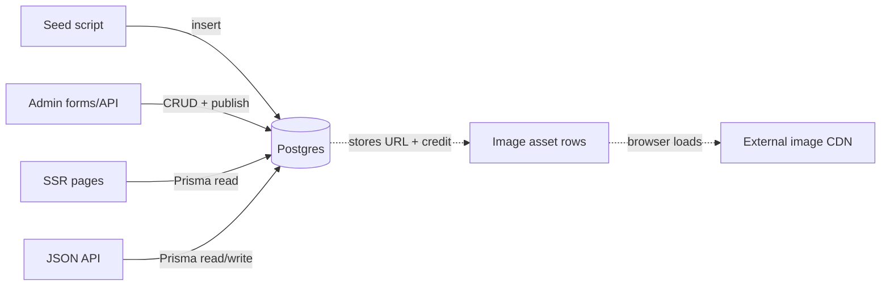
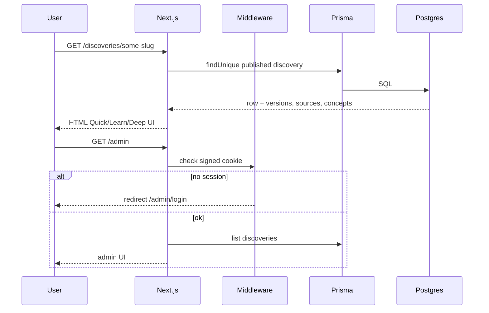

# Cosmic Gateway — Architecture

**Motto:** A daily gateway from astronomy discoveries to genuine understanding.

Cosmic Gateway is a **web-first content CMS + learning reader**: curated discovery explainers live in PostgreSQL; Next.js reads that database and renders public pages and admin tools. Hero images and primary-source links point outward to facility CDNs (ESA/Webb, ESO, NASA). Nothing is scraped from news sites as canonical text.

---

## System overview

```mermaid
flowchart TB
  subgraph clients [Clients]
    Browser[Browser]
  end

  subgraph web [apps/web — Next.js 15]
    Pages[Public pages<br/>/, /discoveries, /concepts, /lessons]
    AdminUI[/admin UI]
    API["/api/v1/* route handlers"]
    MW[middleware.ts<br/>admin session check]
    Lib[lib/db, content, admin-auth]
  end

  subgraph packages [Workspace packages]
    Contracts[packages/contracts<br/>Zod schemas]
    Database[packages/database<br/>Prisma client + schema]
  end

  subgraph data [Data]
    PG[(PostgreSQL<br/>Docker local / managed prod)]
    Seed[prisma/seed.ts<br/>+ seed-launch-batch.ts]
    CDN[Hero images hosted externally<br/>ESA/ESO/NASA CDNs]
  end

  Browser --> Pages
  Browser --> AdminUI
  Browser --> API
  AdminUI --> MW
  API --> MW
  Pages --> Lib
  AdminUI --> Lib
  API --> Lib
  Lib --> Database
  Lib --> Contracts
  Database --> PG
  Seed --> PG
  Pages -.->|img src URLs only| CDN
```

**One app, not a microservices mesh.** Next.js serves the UI and the API. Prisma talks to Postgres. There is no Redis, NestJS extraction, scraper, or mobile app in this phase.

---

## Repo layout

| Path | Role |
|------|------|
| `apps/web` | Next.js App Router — public site, admin, `/api/v1`, middleware |
| `packages/database` | Prisma schema, migrations, seed, shared `prisma` client |
| `packages/contracts` | Shared Zod types (e.g. create-discovery payload) |
| `docs/` | Progress, product plans, this architecture note |
| `scripts/hash-admin-password.mjs` | Generate admin hash + `AUTH_SECRET` |
| `docker-compose.yml` | Local Postgres only |
| `vercel.json` | Deploy build hints |

---

## Where data comes from

Content is **not** fetched live from astronomy APIs or news sites at page-request time.



1. **Seed (local / first populate)** — `pnpm db:seed` runs `packages/database/prisma/seed.ts`, which resets demo tables and inserts topics, concepts, lessons, image metadata, sources, and published discoveries (`seed.ts` + `seed-launch-batch.ts`). Hero images are **URLs** only; image bytes stay on facility CDNs.
2. **Admin (ongoing)** — Drafts, sources, status transitions, and publish write through `/api/v1/admin/*` into the same database.
3. **Public pages** — Server components call Prisma (e.g. `getDiscoveryBySlug` in `apps/web/src/lib/db.ts`). Tip-queue URLs are **metadata signals**; published body text is what you authored or seeded.
4. **Public JSON API** — Same database via `GET /api/v1/discoveries` and `GET /api/v1/discoveries/[slug]`.

---

## Request flow



---

## Important modules (`apps/web`)

| Module | Job |
|--------|-----|
| `lib/db.ts` | Prisma queries for discoveries |
| `lib/content.ts` | Shape DB rows for UI; publish gates |
| `lib/status.ts` | Allowed editorial status transitions |
| `lib/admin-auth.ts` | Password verify, signed session cookie |
| `middleware.ts` | Gate `/admin` and `/api/v1/admin/*` |
| `components/discovery-reader.tsx` | Quick / Learn / Deep reader |
| `app/api/health` | App + DB reachability |

---

## Scripts (root `package.json`)

| Script | What it does |
|--------|----------------|
| `pnpm dev` | Start Next.js (`apps/web`) |
| `pnpm build` | Generate Prisma client, then build packages |
| `pnpm typecheck` / `pnpm lint` | TypeScript / lint across the workspace |
| `pnpm db:generate` | `prisma generate` → typed client |
| `pnpm db:migrate` | Dev migrations (`migrate dev`) |
| `pnpm db:migrate:deploy` | Production migrations |
| `pnpm db:seed` | Wipe + load launch demo content |
| `pnpm db:studio` | Prisma Studio GUI |
| `pnpm hash-admin-password` | Print `ADMIN_PASSWORD_HASH` + `AUTH_SECRET` |
| `pnpm test` | Publish-gate tests in the web app |

---

## Content model (high level)

Editorial workflow for discoveries:  
`draft → science_review → rights_review → ready_to_publish → published → archived`

Publish gates require at least one source and either a rights-cleared hero image or an explicit no-image exception. Each published discovery stores Quick / Learn / Deep markdown versions, linked concepts and lessons, evidence status, and source records (primary facilities/papers first; news tips secondary).

**Evidence status policy:** `peer_reviewed` requires at least one linked `paper` source. Facility announcements without a paper link use `official_release`. Track per-article badges in [content/article-concept-links.md](./content/article-concept-links.md).

**Related discoveries:** `discovery_relations` joins articles. Public pages show bidirectional related links; drafts can pass `relatedDiscoveryIds` on create. Seeded clusters are listed in the content inventory.

---

## Related docs

- [PROGRESS.md](./PROGRESS.md) — what is built and what is next
- [product-engineering-plan.md](./product/product-engineering-plan.md) — original product/engineering plan
- [public-beta-validation-plan.md](./product/public-beta-validation-plan.md) — public beta milestones
